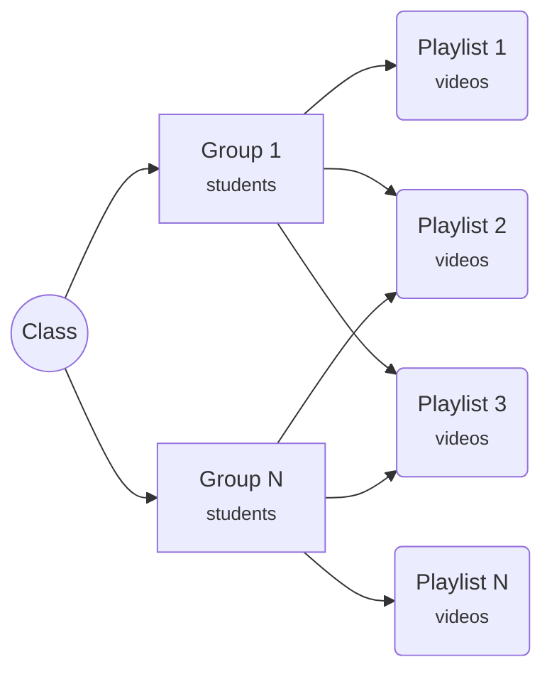

[toc]

# Hydra Educational Platform

Hello visitor, and welcome to my masters' degree project. 

Тhe original assignment was "Design and Develop a **Video Lectures Application**", and this is the solution.

## Description

Hydra Educational Platform (HEP) platform is designed to support the educational process of both teachers and students. Its purpose is to provide teachers with a convenient way to organize teaching materials and to facilitate students' access to them.  HEP's main idea is to be a secure, modular training system, where each module is an independent stand-alone application that provides specific functionality. For example, a video tutorials module in which students can watch videos of lectures and exercises pre-uploaded and organized by the teacher. Or a contest  module in which to conduct examinations and tests in various forms. Or even an evaluation AI module. 

The current implementation includes two basic modules. *Authentication module* which is supposed for user management, and *module for Videos sharing*, where trainers can upload their video courses and share them with the students.

### Authentication module

The authentication module dictates access to the system. This module is an integral part of the basic system. In addition to managing users, it's also responsible for their authentication. This means that all other modules rely on it to authenticate its users, as well as to retrieve the complete user list.  

There are three levels of access defined as user roles.

- **Administrator**. Has full access to the base system and authentication module. It's main purpose is to manage users. 
- **Trainer**. The purpose of that role is to manage content. Has no access to authentication module. 
- **Student**. Can enter the system and manage his personal data. Its access to the content is managed by Trainer.

Multiple roles can be assigned to a user.

### Video Sharing module

This module is a place where teachers can upload and manage their video lectures, as well as a place where students can watch them. Here is how the module is structured.

The main and most important unit is the *Video* file. The *Trainer* can upload *Video* files in the appropriate section. To make them available to *Students*, he need to put them in the *Playlist*.

The *Playlist* logically groups *Videos*, so the Trainer have to ensure that they are named and described correctly according to the topic.

The next important unit is the *Study Group*. It has two main roles. The first is the logical grouping of *Students*. When a *Trainer* create a *Study Group*, he can add *Students* to it by selecting them from a complete list managed in the authentication module. The second role of the *Study Group* is to connect the *Students* with the *Playlists*. All *Videos* in *Playlists* assigned to the same *Study Group* are available to its members *(Students)*. The *Trainer* can create as many groups as he want, according to his criteria. But have to keep in mind that the *Study Groups* and *Playlists* he create are only available to hem and his *Students*, other *Trainers* cannot manage them. But the *Videos* are shared, they are available to all *Trainers*. This way, the *Trainer* can add *Videos* uploaded by other *Trainers* to his *Playlists*.

The last and basic unit is the *Class*. Its aim is to wrap a number of *Study Groups* for better structuring. It could be an academic specialty, faculty, or something. Аs *Study Groups* live in *Class*, to create a *Study Group* the *Trainer* must first create a *Class*. *Groups* are created in the *Class* edit section.

## User registration

There are two ways to add users to the platform.

### Registration form. 

Users are only required to provide the most basic registration information, a valid email, and a password. Once the email address is validated, the user automatically gets the role of Student and can log in. As more data on the user are required for the correct functioning of some modules, he can be asked to provide it after logging in, such as Name, Faculty Number, etc. 

### User management section

Administrators can add users via Authentication module in user management section. They also can edit user data of already registered users, add/remove roles, manually confirm emails, etc.

## Technology Stack

Blazor, .NET 6, Azure

## Architecture

micro frontends ...

### APIs

## Data Bases

